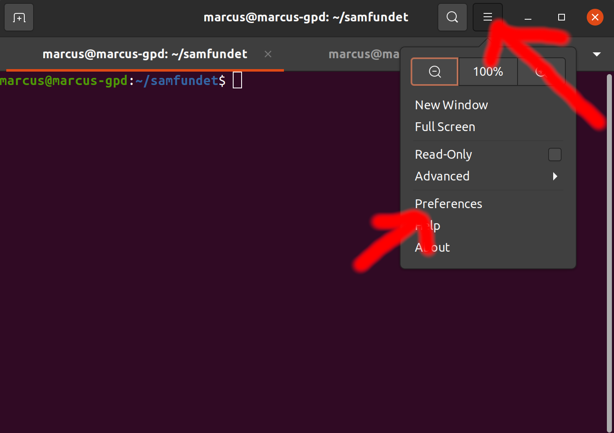
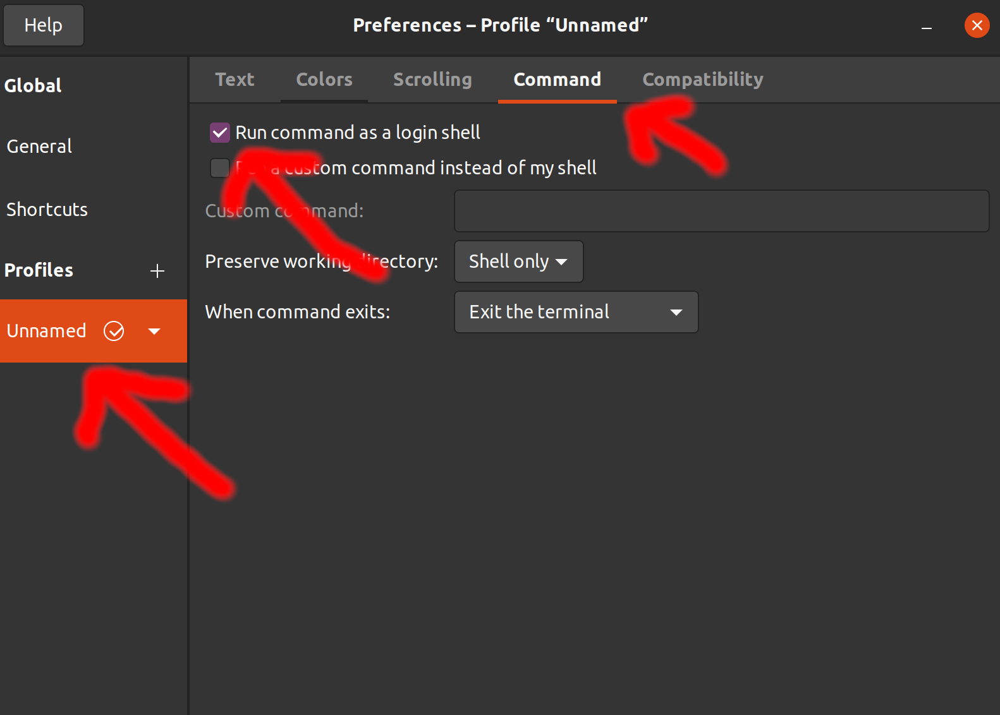

# [Samfundet.no](http://samfundet.no)


[](https://travis-ci.org/Samfundet/Samfundet)

<br>
<br>

## Installation

Follow the steps below in order to setup our project locally.

> For macOS users: You can try running `make setup-mac` in the root directory. That command will essentially do everything that this `README` tells you do to, but we can't guarantee that it works.

<br>
<br>

### Complete installation for MacOS / Ubuntu

A Github Personal Access Token (PAT) is required to run this script. You can make one here https://github.com/settings/tokens/new. Tick scopes `repo`, `read:org` and `admin:public_key`), then store the token somewhere safe (Github will never show it again).

Copy these commands (press button on the right-hand side of the block) and run from the directory you would clone the project.

#### Non-interactive

```sh
read -s -p "Github PAT token: " TOKEN ; X_INTERACTIVE=n /bin/bash -c "$(curl -fsSL https://$TOKEN@raw.githubusercontent.com/Samfundet/Samfundet/master/{bash_utils.sh,install.sh})" && . ~/.bash_profile && cd Samfundet ; unset TOKEN ; unset X_INTERACTIVE;
```

#### Interactive

```sh
read -s -p "Github PAT token: " TOKEN ; X_INTERACTIVE=y /bin/bash -c "$(curl -fsSL https://$TOKEN@raw.githubusercontent.com/Samfundet/Samfundet/master/{bash_utils.sh,install.sh})" && . ~/.bash_profile && cd Samfundet ; unset TOKEN ; unset X_INTERACTIVE;
```

<!--
```sh
read -s -p "Github PAT token: " TOKEN ; X_INTERACTIVE=y /bin/bash -c "$(curl -fsSL https://$TOKEN@raw.githubusercontent.com/Samfundet/Samfundet/935-dockerize/{bash_utils.sh,install.sh})" && . ~/.bash_profile && cd Samfundet ; unset TOKEN ; unset X_INTERACTIVE;
``` -->

<details>
    <ul>
      <li>
        X_INTERACTIVE (y/n) determines how many prompts you receive before performing an action.
      </li>
      <li>
        Fetches files {bash_utils.sh, install.sh} and runs bash.
      </li>
      <li>
       f: fail fast
      </li>
      <li>
        s: silent, no progress-meter
      </li>
      <li>
        S: show error on fail
      </li>
      <li>
        L: follow redirect
      </li>
    </ul>
</details>

<br>
<br>

### Clone

Clone our main [repository](https://github.com/Samfundet/Samfundet):

```bash
git clone https://github.com/Samfundet/Samfundet.git
```

We also use two other repositories, [SamfundetAuth](https://github.com/Samfundet/SamfundetAuth) and [SamfundetDomain](https://github.com/Samfundet/SamfundetDomain). These can be cloned with the following commands:

```bash
# SamfundetAuth
git clone https://github.com/Samfundet/SamfundetAuth.git

# SamfundetDomain
git clone https://github.com/Samfundet/SamfundetDomain.git
```

<br>
<br>

### Dependencies

There are several dependencies needed to get Samfundet up and running. Note that RVM is a Ruby version manager used for handling different Ruby versions, but you can use others as well (like [rbenv](https://github.com/rbenv/rbenv)).

<hr>

#### macOS:

1. [Homebrew](https://brew.sh/): `/bin/bash -c "$(curl -fsSL https://raw.githubusercontent.com/Homebrew/install/master/install.sh)"`
2. [imagemagick](https://formulae.brew.sh/formula/imagemagick): `brew install imagemagick`
3. [graphviz](https://graphviz.org/): `brew install graphviz`
4. [RVM](https://rvm.io/)

<hr>
<hr>

#### Linux:

##### Option 1 (Automatic)

1. Go to your terminal preferences, and select your terminal profile. Go to the "Commands" tab and check "Run command as a login shell".
<details>
    <summary>Screenshot 1</summary>
    
</details>
<details>
    <summary>Screenshot 2</summary>
    
</details>

<!--


-->

<br>

2. Make sure you have navigated to the project directory in the terminal. Then run the following script: (copy and paste into terminal)

   ```bash
   ./linux-prerequisites.sh
   ```

   This will make a script run, that will install a few dependencies for you. A restart is however required after running this script, so restart your computer before proceeding to step 3.

3. Navigate back to the project and run the following script:

   ```bash
   ./linux-setup-rvm.sh
   ```

   A restart is also required after running this script. Restart before proceeding to step 4.

4. Navigate back to the project and run the following script:

   ```bash
   ./linux-setup-database.sh
   ```

   After this script has completed, the project should be up and running!

<br>

##### Option 2 (Manual)

1. [graphviz](https://graphviz.org/): `sudo apt-get install graphviz`
2. [imagemagick](https://imagemagick.org/): `sudo apt-get install imagemagick`
3. [nodejs](https://nodejs.org/): `sudo apt-get install nodejs`
4. [ubuntu_rvm](https://github.com/rvm/ubuntu_rvm)
5. Source RVM: `source ~/.rvm/scripts/rvm`

We now have all dependencies installed, including RVM, so let's install Ruby 2.5.5. Run these two commands in succession:

```bash
rvm install 2.5.5 --movable
rvm use 2.5.5 --default
```

<hr>

<br>
<br>

### Setup database

We use PostgreSQL as our database. There are several ways it can be installed depending on your operating system.

<hr>

#### Linux:

##### Option 1 (manually)

- Install PostgreSQL:
  ```sh
  sudo apt-get install postgresql postgresql-contrib libpq-dev
  ```
- Create the PostgreSQL user:
  ```sh
  echo -e "CREATE USER samfundet WITH PASSWORD 'samfundet';\nALTER USER samfundet CREATEDB;" | sudo -u postgres psql
  ```

##### Option 2 (Docker)

1. Install [Docker Engine](https://docs.docker.com/install/linux/docker-ce/ubuntu/) and [Docker Compose](https://docs.docker.com/compose/install/).
2. Start the database: `docker-compose up -d`
3. Install PostgreSQL: `sudo apt-get install libpq-dev`

<hr>

<hr>

#### macOS:

##### Option 1 (PostgreSQL macOS application)

- Install the [PostgreSQL macOS application](https://postgresapp.com/).

<br>

##### Option 2 (Docker)

1. Install Docker: `brew cask install docker`
2. Start the database: `docker-compose up -d`
3. Install PostgreSQL: `brew install postgresql`

<hr>

<br>
<br>

### Ruby dependencies (gems)

Samfundet depends on several Ruby dependencies called gems that are listed in our `Gemfile`. To install these, run

```bash
bundle install # or just 'bundle' or 'bundler'
```

<br>

### Configure database

First, there are some configuration files that needs to be copied. Run

```bash
make copy-config-files
```

Then, setup the database with

```bash
bundle exec rails db:setup
```

<br>
<br>

### Start the development server

You are now ready to start the server. Run

```bash
make run # which executes 'bundle exec rails server'
```

<br>
<br>
<br>

## Git hooks

You can optionally add checks before commits et cetera through `git/hooks`. To apply them run

```bash
make git-hooks
```

This will add symbolic links in .git/hooks from the hooks dir.

## License

MIT © Samfundet.no project authors
